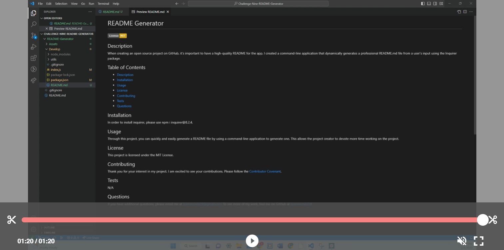

# README Generator

## Description
 When creating an open source project on GitHub, it’s important to have a high-quality README for the app. I created a command-line application that dynamically generates a professional README.md file from a user's input using the Inquirer package.

## Table of Contents
- [Description](#description)
- [Installation](#installation)
- [Usage](#usage)
- [Contributing](#contributing)
- [Questions](#questions)

## Installation
In order to install inquirer, please use:
npm i inquirer@8.2.4

## Usage
Through this project, you can quickly and easily generate a README file by using a command-line application to generate one. This allows the project creator to devote more time working on the project. 

The application will be invoked by using the following command: 
node index.js

## Contributing
Thank you for your interest in my project. I am excited to see your contributions. Please follow the [Contributor Covenant](https://www.contributor-covenant.org/).

## Questions
If you have additional questions, please email me at bsimmonds28@gmail.com.
To see more of my work, find me on GitHub at [bsimmonds28](https://github.com/bsimmonds28)!
